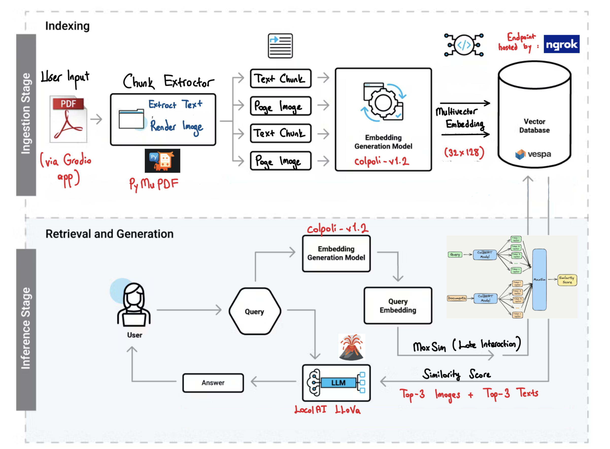

# Multimodal Retrieval Augmented Generation (RAG) Pipeline with ColPali + Vespa + LLaVA

This project implements a **Multimodal Retrieval-Augmented Generation pipeline** that combines **ColPali**, **Vespa**, **BLIP**, and a **locally running LLaVA model** to allow users to upload documents (PDFs) and query both text and image content for context-aware, grounded answers.

## Architecture Diagram

## Pipeline Overview

1. **PDF Processing**: Extract text + render images.
2. **Multimodal Embedding**: Encode both modalities using ColPali into shared latent space.
3. **Multivector Storage**: Store embeddings in Vespa with custom schema.
4. **MaxSim Retrieval**: Query by calculating max-similarity across text & image vectors.
5. **Local Generation**: Use LocalAI + LLaVA to generate grounded multimodal answers.
6. **User Interface**: Gradio app for easy interaction and visualization.

## What is ColPali?

Unlike traditional retrievers that treat text and images separately, ColPali jointly embeds both modalities in a single, aligned space. It's lightweight, accurate, and ideal for document-level multimodal search — removing the need for separate encoders and enabling efficient multivector storage and retrieval.

## 🎥 Demo Video

[Demo video Google Drive]([https://your-google-drive-link-here](https://drive.google.com/file/d/1d9aEpawugvF-HpCs1mrhQ3Fx9Iv2_QKz/view?usp=sharing))

##  Tech Stack

- **ColPali**: Multimodal encoder (text + image)
- **BLIP**: Image captioning for semantic context
- **Vespa**: Multivector vector DB
- **LLaVA via LocalAI**: Local VLM for generation
- **Gradio**: UI for interactive retrieval

